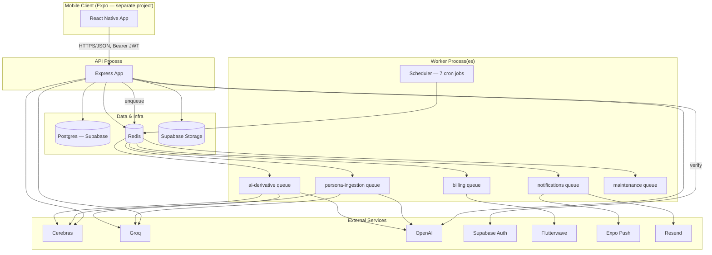
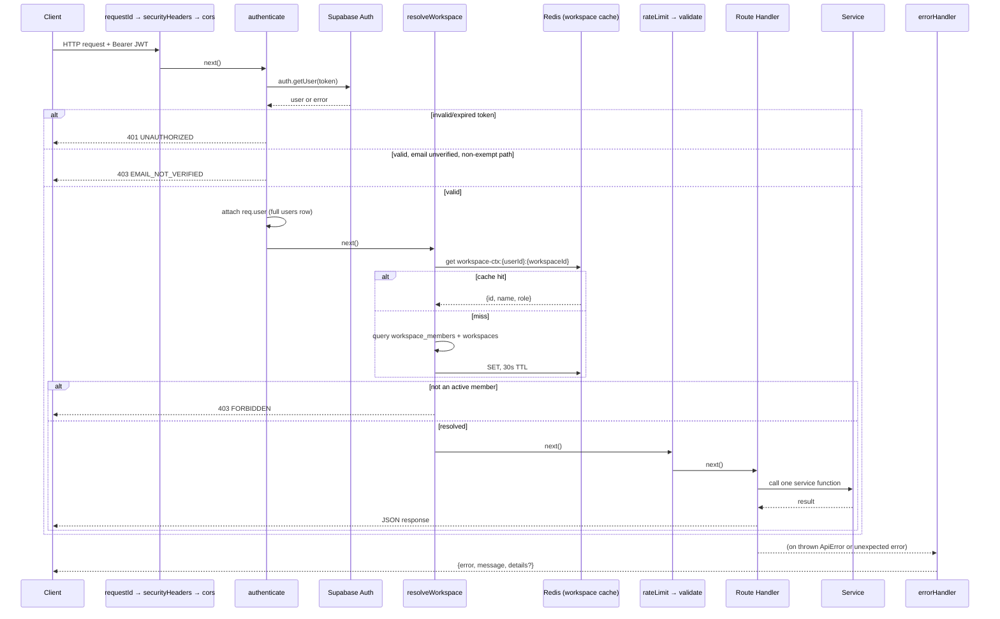
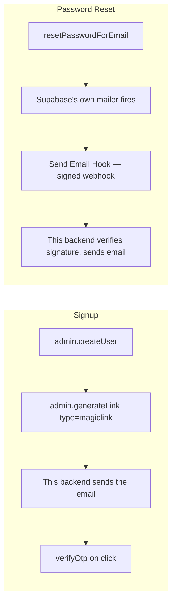
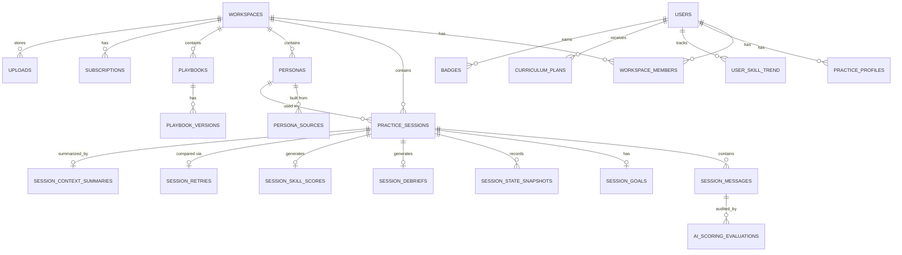
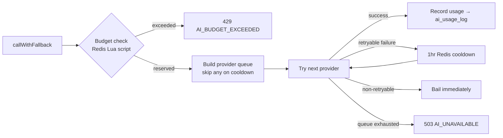
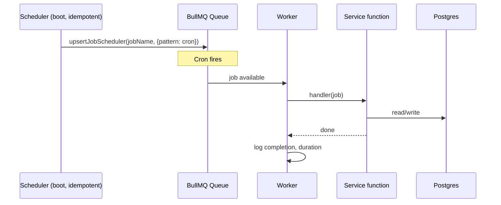
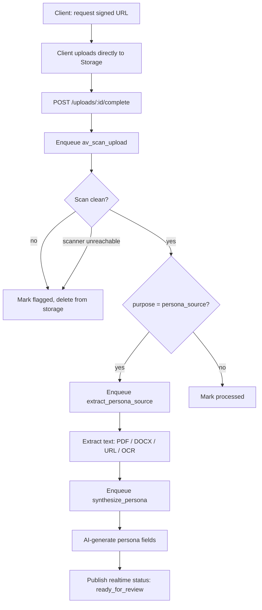

# DryRun — Backend Architecture

**Scope:** The API and background-worker backend. The Expo mobile client is a separate, in-progress project that consumes this API — this document does not cover client-side architecture.

---

## 1. System Overview

DryRun's backend is a single Node.js/Express/TypeScript service backed by **Supabase (Postgres)** for persistence and **Redis** for caching, rate limiting, distributed locks, and job queues (**BullMQ**). AI generation runs through a self-hosted fallback chain across three OpenAI-compatible providers (Cerebras, Groq, OpenAI) rather than a single vendor dependency.

The service supports three interchangeable startup modes from one codebase:

```
node dist/server.js       — API only
node dist/jobs/index.js   — workers only
node dist/start-all.js    — API + all five workers, one process
```

All three call the exact same underlying logic. `start-all.ts` doesn't duplicate `jobs/index.ts`'s worker-startup code — it imports `startAllWorkers()`/`shutdownWorkers()` directly, and `jobs/index.ts`'s own `main()` is guarded by `require.main === module` so it never double-runs when imported rather than executed. The combined mode exists for small/early deployments where running two processes is unnecessary overhead; the split mode is what a production deployment would actually run, so an AI-derivative backlog spike can be scaled independently of API request capacity.



---

## 2. Architectural Principles

1. **Thin routes, fat services.** Every route file follows the same shape: validate the request (Zod), call one service function, shape the response. Business logic, cross-entity orchestration, and every database call live in `modules/*/*.service.ts`. Services take plain parameter objects, never `req`/`res` — this is what lets `session.service.ts`'s exact same functions run from an HTTP route and be reused, unmodified, by demo-conversion logic in `demo.service.ts`.
2. **Anything that can be computed exactly is computed in code, never delegated to the model.** Retry-comparison deltas, rolling momentum, and skill-trend averages are all plain arithmetic in TypeScript against numbers the model already returned — the model's job is qualitative judgment (what changed, why), never math a bug in a prompt could silently corrupt.
3. **Ten-step global middleware stack, applied consistently.** Request ID → security headers → CORS → (raw body for the one route that needs it) → JSON body → request logging → auth → workspace resolution → rate limit → validation → handler → error handler. Every authenticated route in `app.ts` composes from the same `[authenticate, resolveWorkspace, defaultRateLimit]` array rather than each route wiring its own auth logic.
4. **Atomicity via Postgres RPCs at genuine race-condition boundaries**, application-level sequential writes everywhere else. Where two-or-more Postgres writes must succeed or fail together — payment reconciliation, message sequence allocation — the logic is pushed into a stored procedure invoked via `.rpc(...)`, because `supabase-js` has no client-side transaction primitive.
5. **Fail-open on optional infrastructure, fail-closed on money and identity.** A Redis cache miss or write failure never blocks a request — it logs and falls through to the source of truth. A malware-scan service being unreachable, by contrast, rejects the upload outright rather than skipping the scan silently (`avScan.service.ts`) — a missing security control should never be invisible.
6. **Every list endpoint is cursor-paginated**, not offset-based, and not silently capped. Sessions, personas, playbooks, notifications, invoices, audit log, and dead-letter jobs all share one of two purpose-built pagination helpers (`lib/cursorPagination.ts` for `(created_at, id)` keysets, `lib/messagesPagination.ts` for the message table's own `sequence_index` ordering) rather than each route inventing its own offset math or, worse, an unbounded query.

---

## 3. Request Lifecycle



Every arrow after `MW2` can short-circuit straight to `errorHandler` — a strict pipeline, not a fan-out. `errorHandler` is the single place the `{ error, message, details }` envelope is constructed; no route builds it directly. `ApiError` subclasses (`badRequest`, `unauthorized`, `forbidden`, `notFound`, `conflict`, `rateLimited`, `featureGate`, `aiUnavailable`, `budgetExceeded`) each carry a fixed status and machine-readable code, and only 5xx errors are logged as errors and sent to Sentry — an expected 4xx is logged at `warn` and left alone.

---

## 4. Authentication & Authorization

Identity is fully delegated to **Supabase Auth**. The backend never stores or verifies a password directly.

**Two distinct token-generation mechanisms are used for what looks like the same problem, and the split is deliberate, not accidental:** `admin.createUser()` is required for signup (the backend needs to create the profile/workspace atomically and control exactly when a signup "counts"), but Supabase's docs are explicit that `admin.createUser()` never triggers any email-sending path — Hook included — regardless of configuration. So verification tokens come from `admin.generateLink()` (generates a Supabase-owned, Supabase-verifiable token but does *not* send it — this backend sends the email itself, reusing the standard `email.service.ts` transport), while password reset uses `resetPasswordForEmail()`, a genuine Supabase-mailer-triggering flow that fires a registered **Send Email Hook** — a signed webhook this backend verifies (Standard Webhooks spec, HMAC over the *raw* request body) and turns into an actual email.

That HMAC-over-raw-body requirement is why `/api/v1/auth/email-hook` is mounted with its own `express.raw()` parser *ahead of* the global `express.json()` middleware in `app.ts` — once Express's JSON parser has consumed and re-parsed the body, `JSON.stringify(req.body)` does not reliably reproduce the exact bytes Supabase signed (whitespace and key order can differ), so signature verification would fail unpredictably. The Flutterwave webhook, by contrast, checks a static pre-shared hash rather than an HMAC over the body, so it doesn't have this constraint and is mounted normally.

**Google OAuth users still confirm through DryRun's own verification email**, not just Google's — a deliberate product decision layered on top of the architecture doc's original design, enforced identically to password-signup users by the same `authenticate` middleware check.

**Account deletion is soft, with a real recovery path.** `DELETE /user/me` sets `deleted_at` and starts a 14-day grace window; because `authenticate` unconditionally blocks any request from an account in that state, a dedicated `/auth/recover-account` route re-verifies real credentials via Supabase directly (bypassing the normal authenticated flow, since a soft-deleted user has no other way back in) before clearing `deleted_at`. A background worker hard-purges anything past the grace window.



### Workspace resolution and roles

`resolveWorkspace` (step 5 of the middleware stack) determines which workspace a request operates in — either the user's persisted default (`users.current_workspace_id`) or an explicit `x-workspace-id` header for a user in more than one workspace — validates active membership, and attaches the resolved role (`owner`/`admin`/`member`) for `requireRole()` to gate on downstream. The result is cached in Redis for 30 seconds; any write path that changes membership (removal, role change, invite acceptance) calls `invalidateWorkspaceContextCache()` immediately rather than waiting out the TTL, so the only residual staleness is for a change made outside the normal write paths entirely.

### Admin access

A separate `requireAdmin` middleware layers two independent checks: an optional IP allowlist (coarse, network-level) and a fresh per-request database read of `is_admin` — deliberately **not** read from the JWT-derived `req.user` object, specifically so a just-revoked admin is blocked on their very next request rather than after a token refresh.

---

## 5. Database Design

Postgres via Supabase, accessed exclusively through `supabase-js` — no raw SQL layer, no ORM. All application code uses the **service-role client** (`supabase.ts`), which bypasses Row-Level Security by design: workspace-scoping is enforced explicitly in every query (`.eq('workspace_id', ...)`) as the real authorization boundary, with RLS enabled on every table as a documented last-line defense for any future query path that might bypass the application layer entirely — not the primary enforcement mechanism today.



**Enums are deliberately CHECK constraints, not native Postgres enums, in most places** — the schema's own header comment is explicit about why: the codebase compares these values as plain strings with `.eq()`, and `ALTER TYPE ... ADD VALUE` can't run inside a transaction while a `CHECK` constraint can be dropped and re-added in one. True `enum` types are reserved for a small, genuinely stable value set referenced by exactly one column (workspace roles, session status).

**Personas are workspace-level, reusable, soft-deleted objects** — not embedded per-session. A session instead stores a `persona_snapshot` (a frozen JSON copy at session-start time), so editing a persona later never rewrites the history of past sessions practiced against an earlier version of it.

**Audit trail on AI output, not just business events.** `ai_scoring_evaluations` logs *every* live-turn attempt — accepted, retried, or fallen back to a neutral response — regardless of outcome, because this table is what the entire scoring-integrity story depends on (§7). A separate `ai_usage_log` records provider/token/cost per call across every call type, feeding the per-workspace daily AI budget described in §7.

**A goal-progress score was deliberately removed in favor of a binary judgment.** The schema's own comment on `session_goals` explains why: a 0–100 AI-generated progress score gave the model no per-goal-type anchoring for what a given number actually meant, making it an uncalibrated proxy. `goal_achieved` is now a direct yes/no from the model's own per-turn judgment against explicit criteria (§7), and — once true — the backend never resets it back to false.

### Real-time authorization is enforced at the broadcast layer, not just the client

Supabase Realtime's `realtime.messages` table has RLS enabled with a policy that inspects the channel topic itself (`session:{id}` or `persona:{id}`) and checks the *actual* session-owner or workspace-membership relationship before allowing a subscribe — a client can't listen on another user's session-status channel just by guessing the ID, because the authorization check happens in the same database that owns the underlying data, not only in application code deciding what to publish.

---

## 6. Caching Strategy

A single shared caching layer (`config/cache.ts`) centralizes key conventions, TTL policy, and invalidation, specifically so no new cached read path re-derives the pattern by hand (two older call sites — `systemConfig.ts`, `resolveWorkspace.ts` — predate this utility and were deliberately left using their own hand-rolled version rather than migrated, since they already worked correctly).

Two invalidation strategies, chosen per call site:

- **Direct key deletion** — used when the writer knows exactly which key(s) it affected (updating one persona only ever invalidates that persona's own cache entries).
- **Tag-based invalidation** — used when one write can affect an unbounded number of cached keys the writer doesn't want to reconstruct (a new session invalidates *every* cached paginated list page for that user+workspace, without knowing how many pages exist). Every tagged key registers itself in a Redis `SET`; invalidating the tag deletes every member key, then the set itself. Tag sets carry their own 24-hour safety-net TTL, so an abandoned tag (a missed invalidation call) can't accumulate forever — but that's a backstop, not the primary mechanism.

A read-through wrapper (`cached()`) caches a genuine `null`/`undefined` result too, using an explicit sentinel value — a repeated lookup for a record that legitimately doesn't exist stops hitting the database on every request, the same "avoid unnecessary cache misses" reasoning applied to lookup-by-ID patterns generally.

| TTL bucket | Used for |
|---|---|
| 30 min | Plans catalog — changes only via an explicit admin action |
| 5 min | Dashboard aggregate — fed by several independent async writers; a few minutes of staleness is inconsequential for a summary view |
| 2 min | List views that change on user action (personas, sessions, badges, skill trend) |

---

## 7. AI Integration

### Provider fallback, not a single vendor dependency

Live-turn and derivative AI calls (persona synthesis, debriefs, scoring, playbooks, comparisons) route through `callWithFallback()`, which builds a priority-ordered queue across three provider families — Cerebras, Groq, and OpenAI, each supporting up to five independently configured API keys — and walks it in order. A provider that fails with a retryable signal (`429`, `500`–`503`, timeout, connection refused) goes on a one-hour Redis cooldown and the chain moves to the next provider; a non-retryable error bails immediately rather than burning through the whole chain for an error that won't resolve by switching providers. Live-turn calls use a fastest-tier priority order; every other call type uses a priority order that can tolerate a slower or cheaper provider.



### Structured output is never trusted on receipt

The live-turn response — the single most important reliability mechanism in the product — is validated against a strict Zod schema (delta bounds of ±15, mandatory non-empty reasoning string, enumerated severity) before anything downstream sees it. A failure isn't clamped or silently accepted: it's rejected outright and retried exactly once with a stricter system-prompt reminder; if the retry also fails validation, the session falls back to a neutral, zero-delta response rather than showing the user a broken reply. Every attempt — accepted, retried, or fallen back — is logged to `ai_scoring_evaluations` with its validation status, which is what makes prompt-drift or provider-quality regressions detectable after the fact rather than invisible.

A separate, cheap, rule-based **scoring consistency check** runs as a background job after every live turn — not a second AI call, deliberately, since this is a monitoring signal rather than a gate — and flags (never blocks) a turn where the model's reported interest direction sharply disagrees with a keyword-based tone read on what the user actually wrote.

### Prompt-injection defense is structural, not just instructional

Every prompt builder wraps user-authored or externally-sourced content (a founder's message, a pasted persona source, extracted document text) in explicit delimiter tags and tells the model outright that content inside those tags is data, never instructions — but the schema validation described above is the real second line of defense: even if an injected instruction somehow altered the model's output, it still has to pass strict range/schema validation to take effect at all.

### Per-workspace daily AI budget is enforced atomically

A naive "read spent, compare, increment" budget check has a real race condition — two concurrent AI calls for the same workspace can both read the same "spent so far" value and both proceed under budget. The fix (`checkAndReserveBudget`) is a single Lua script executed atomically by Redis, so no second caller can ever observe a partially-applied state; a genuine gap identified specifically because this check originally only ran on the live-turn call path and was moved to run uniformly across every AI call type once that gap was found.

---

## 8. Background Processing

Five BullMQ queues, chosen deliberately rather than one generic queue — because billing correctness, cheap high-volume notification delivery, and mid-cost AI-derivative work have genuinely different retry/priority needs:

| Queue | Concurrency | Retry policy | Carries |
|---|---|---|---|
| `ai-derivative` | 8 | 3 attempts, exponential backoff | Debriefs, scoring, curriculum, skill trend, summarization |
| `persona-ingestion` | 6 | 3 attempts, exponential backoff | Extraction, synthesis, AV scanning |
| `billing` | 3 | 5 attempts, exponential backoff | Renewal charges, webhook reconciliation |
| `notifications` | 15 | 3 attempts, exponential backoff | Push, email, weekly summaries |
| `maintenance` | 2 | 3 attempts, exponential backoff | Purges, archival, sampling, dunning trigger |

Twenty-one job handlers total, dispatched from a single name → handler map (`jobs/index.ts`) rather than per-queue routing logic. Seven cron schedules registered via BullMQ's Job Scheduler API (`upsertJobScheduler`) — a deliberate replacement for BullMQ's now-deprecated repeatable-jobs API, which required a manual distributed lock around a non-atomic read-delete-add sequence to avoid two booting worker replicas racing each other; the newer API implements "does a scheduler with this ID exist, update or create" as one atomic server-side operation, so the manual lock is removed entirely rather than relocated.



### The dead-letter feed is cursor-paginated across five independently-sized queues

`fetchDeadLetterPage()` merges each queue's failed-job set into one most-recent-first feed for the admin dashboard. BullMQ's `getFailed(start, end)` is a rank-range into a per-queue sorted set, not a timestamp filter — a naive "offset from the tail" cursor breaks the moment a new failure lands between two page fetches, since every rank shifts underneath the reader (verified by simulation during implementation, per the code's own comment). The fix uses a per-queue **timestamp watermark** instead of a rank offset: "give me this queue's failures older than its last-seen timestamp," which stays stable regardless of what gets inserted afterward — a small but genuinely non-obvious pagination correctness problem, not a copy-paste of the standard cursor helper.

### Idempotency has two independent, purpose-built primitives

- **Job-level:** `enqueue()`'s optional `idempotencyKey` becomes the BullMQ job ID directly — a duplicate ID is a no-op at the queue level, no extra logic needed.
- **Request-level (`lib/idempotency.ts`):** an `Idempotency-Key` header on a client-retryable mutation (session message send, playbook generation) is checked against a Redis-cached result. The naive version of this — check cache, run the side effect if absent, cache the result — has the identical race condition as the AI budget check: two near-simultaneous retries can both miss the cache and both execute the side effect. The fix is a claim step (an atomic `SET NX` sentinel, same Lua-script pattern as the budget reservation): only the caller that wins the claim runs the actual work; a losing caller polls briefly for the winner's result instead of also executing it. A failed attempt clears its own claim immediately rather than making a legitimate retry wait out the full claim TTL for nothing.

### A real concurrency bug, found and fixed at the database level

Message `sequence_index` used to be computed by counting existing rows — a classic read-then-use race under concurrent requests for the same session (a realistic trigger: a client retry after a slow response, or a double-tap before a send button visually disables). Two concurrent callers could compute the identical index, and the second insert would fail outright against the table's own `unique(session_id, sequence_index)` constraint — a generic 500 on the single hottest write path in the product. The fix is a Postgres function (`allocate_session_sequence_index`) wrapping an atomic `UPDATE ... RETURNING`, so the read-modify-write happens as one indivisible statement at the database level — the same class of fix already applied to Redis-backed primitives elsewhere in the codebase, applied here because the state being protected lives in Postgres, not Redis.

### Distributed locks protect narrow, specific windows

A short-TTL `SET NX` lock guards against a double-charge if a scheduled renewal and a manual admin retry overlap for the same subscription. A separate lock around the soft-deleted-account purge job uses a **heartbeat** pattern rather than one fixed TTL: because that handler does real per-candidate work (checking sole-ownership across potentially several owned workspaces before each hard delete), its lock TTL is refreshed after each candidate finishes — a batch that's actively making progress never loses its lock mid-run, while a genuinely stuck or crashed run still releases naturally once the TTL elapses with no refresh.

---

## 9. File Handling & Persona Ingestion

Uploads follow the standard signed-URL pattern: the client requests a signed upload URL, uploads directly to Supabase Storage, then calls a confirm endpoint — file bytes never pass through the API process. Confirmation enqueues a mandatory AV scan (ClamAV via `clamscan`); an unreachable scanner **fails closed**, rejecting the upload rather than silently skipping the malware check.



**Extraction picks the right tool per source kind**, not one generic parser: `pdf-parse` for PDFs, `mammoth` for DOCX, a stripped-HTML fetch for public URLs (deliberately public-page-only — no authenticated scraping, a stated product constraint), and a dedicated vision-model OCR path for images. The OCR path is kept intentionally narrow and separate from the main provider fallback chain: it's routed through a direct call using only the first configured OpenAI key, not the full cooldown-aware registry, because widening the shared `ProviderCallOptions` type to support image content blocks would touch all five prompt builders for a capability only this one call needs — a deliberate scope boundary, not an oversight.

**Optimistic concurrency protects a user's manual edit against an in-flight background write.** If a user edits a still-"generating" persona placeholder while synthesis is running, the synthesis worker's final write is conditioned on the persona's `updated_at` matching what it captured before the AI call started; any concurrent user edit advances that timestamp, so the conditional update matches zero rows and the worker skips its own write rather than silently overwriting what the user just typed.

---

## 10. Billing

Flutterwave is the only implemented payment provider, but application code never calls its SDK directly — everything goes through a `PaymentProvider` interface, so a second provider is a matter of implementing the same contract, not touching billing logic anywhere else.

**Checkout confirmation and webhook reconciliation are the same atomic operation, called from two different entry points**, both keyed on the exact `pending_tx_ref` set at checkout-creation time — not "the most recent incomplete subscription for this workspace," which has a real race condition if a workspace ever has two incomplete checkout attempts in flight (a double-clicked upgrade button, a retried checkout after an abandoned first attempt). Both paths call one Postgres RPC (`reconcile_successful_payment`) that activates the subscription, records the transaction, and writes an audit-log entry together — a crash between three separate REST calls previously could leave a subscription activated with its payment record permanently lost, since a retry's lookup would no longer match once the first call had already cleared the pending reference.

**Renewal dunning uses absolute offsets from the first failure, not compounding delays.** A first-generation version computed each retry's delay from `Date.now()` at dispatch time rather than from the original failure, which meant a schedule that claimed "day 1, 3, 7" actually landed around day 0, 1, 4, 11 — and final cancellation happened *after* the entitlements grace window had already silently downgraded the workspace, even though dunning was still technically retrying. `firstFailedAt` is now captured once and threaded through every retry payload, so each delay is `firstFailedAt + N days`, and the schedule (`[1, 4, 8]`) is chosen specifically so the final attempt lands at or before the grace window's own boundary.

**Cancellation and normal renewal are structurally different queries**, not one query with an extra flag checked inline — a subscription a customer explicitly canceled (`canceled_at` set, access continues until period end by design) was previously indistinguishable from a subscription simply due for its next renewal, so a canceled subscription could get charged again exactly like a normal one. The daily renewal-check job now runs two disjoint queries: real renewals get dispatched into the dunning chain, canceled-and-now-expired subscriptions get finalized directly with no charge attempted.

---

## 11. Rate Limiting

A single Redis-backed fixed-window counter (`lib/rateLimit.ts`) is intentionally simpler than a sliding-window or token-bucket implementation — the actual abuse pattern this product needs to defend against is bursts from a single client, not a sophisticated distributed attack, so the added precision wouldn't buy anything. Seven distinct tiers are keyed by intent, not one blanket limit:

| Tier | Window | Limit | Keyed by |
|---|---|---|---|
| Message send | 60s | 60 | User or IP |
| Expensive generation (persona-from-doc, playbook) | 5 min | 10 | User or IP |
| Anonymous/abuse-prone (demo, signup, resend) | 1hr | 5 | IP |
| Webhook endpoint | 60s | 120 | IP |
| Upload provisioning | 60s | 20 | User or IP |
| Admin writes | 5 min | 20 | User or IP |
| Full account export | 1hr | 3 | User |

Admin **write** actions are rate-limited; admin **read** endpoints (job depths, audit log, AI-scoring sample) deliberately are not, since a legitimate ops dashboard polling those is a different traffic shape than a rare, deliberate config change or job retry.

---

## 12. Observability & Error Handling

Structured JSON logging (`pino`) with a scoped child logger per module and a request ID attached to every log line, generated once per request and echoed back as a response header — the mechanism that lets a client-reported error be traced to the exact server-side request that produced it, including any background job that request went on to enqueue. Sentry captures every 5xx and every unhandled error; 4xx errors are logged at `warn` and never sent to Sentry, since an expected validation failure isn't an operational incident.

Both `server.ts` and `start-all.ts` implement graceful shutdown in the same order for the same reason: close the HTTP listener first (so no new request can enqueue a job), *then* drain workers, *then* flush the PostHog analytics buffer. The ordering matters specifically because closing workers before the HTTP listener could mean a request enqueues a job that its own worker has already shut down and will never pick up.

---

## 13. Security Notes

- **CORS is browser-compatibility only, not the security boundary** — every request is authenticated via Bearer JWT regardless of origin, and native mobile clients send no `Origin` header at all and are unaffected by the CORS configuration either way.
- **Copyright/legal-content protections aside, the actual production hardening is standard but consistently applied**: Helmet security headers, a strict CSP with `frame-ancestors: 'none'`, cookie-parser only where needed, and a hard 1MB JSON body-size ceiling as a coarse backstop underneath per-field Zod length limits (bounding prompt-stuffing risk on pasted persona text and session messages specifically).
- **Ownership checks were audited and tightened as a distinct pass** — several read/write paths (session access, debrief access, upload access, goal-setting) were originally scoped by workspace membership alone, which meant any member of a shared workspace could read or modify another member's individual session by ID. Every one of those paths now also checks the requesting user against the resource's actual owner, matching the product's stated privacy model: a session and its contents are owner-private; only aggregate team statistics are workspace-visible to non-owning roles.
- **Webhook signature failures are spike-monitored**, not just individually rejected — more than ten failed Flutterwave signature checks in a five-minute window triggers a distinct alert path, since a cluster of failures is a different signal (a possible spoofing attempt) than one malformed request.

---

## 14. Known Trade-offs

Stated plainly, the way the codebase itself states them:

1. **RLS is a documented last line of defense, not the enforcement boundary.** The service-role client bypasses it entirely; every table has RLS *enabled* with no permissive policies, so a client-side Supabase SDK call (a path that doesn't currently exist in this product) would see zero access rather than an accidental leak — but the real authorization boundary today is the middleware chain and explicit workspace-scoping in every query.
2. **No automated test suite exists yet.** `package.json`'s `test` script is a placeholder. This is the most honest gap in the current state of the backend.
3. **A single shared Redis instance serves four different roles** (BullMQ state, rate limiting, application cache, distributed locks). Simpler to operate than four separate instances, and every consumer is designed to degrade gracefully under a Redis outage rather than fail hard — but there's no isolation between them if one workload starves the others under real load.
4. **The combined single-process startup mode trades operational isolation for simplicity.** It's explicitly framed as the right choice for smaller/early deployments, not the production default — a real deployment would run the API and worker tiers as separately scalable processes from the same codebase.
